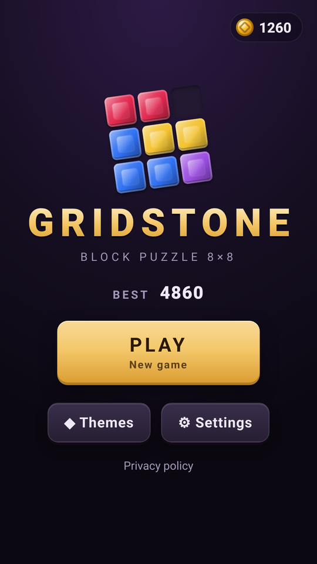
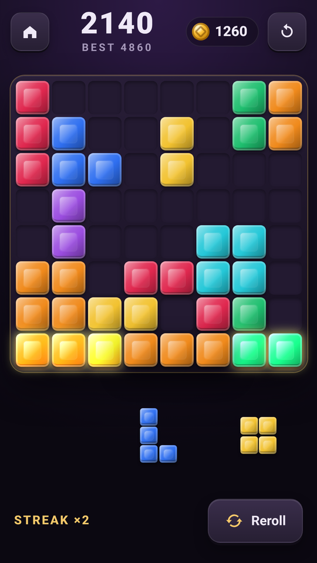
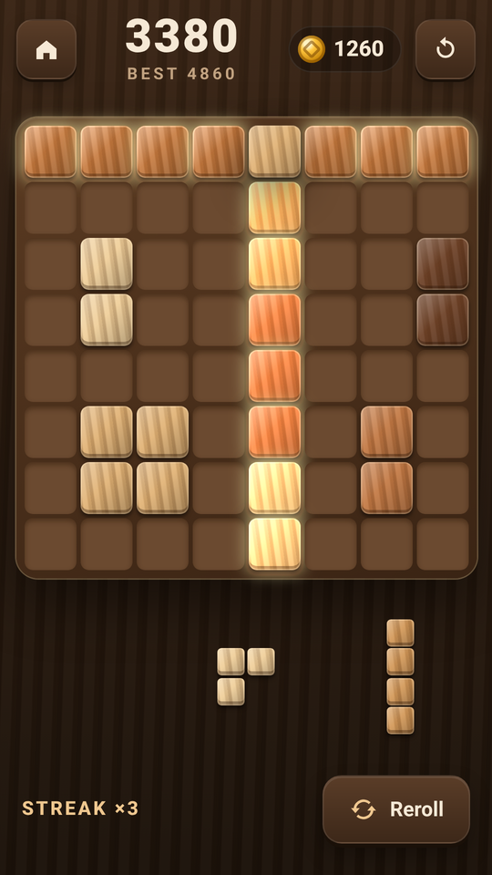
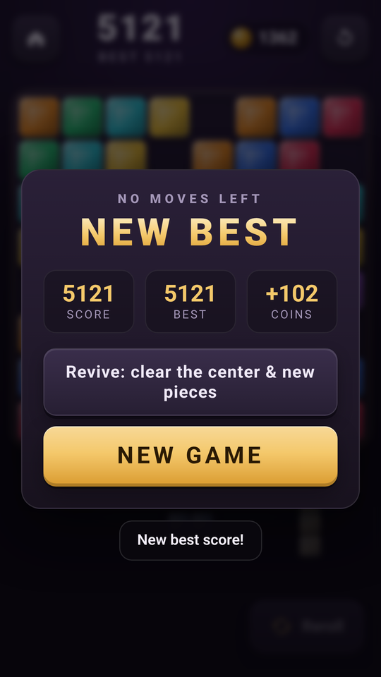

# 💎 Gridstone: Block Puzzle 8×8

A sleek, **offline 8×8 block puzzle**. Drag gem and wood blocks onto the board, fill complete rows and columns to shatter them, and chain clears for combo and streak bonuses. It's written in vanilla HTML/CSS/JavaScript with no framework and ships as an **Android app** (Capacitor 8 + Google AdMob) that **GitHub Actions** builds and signs automatically.

**▶ Play the live demo:** https://offerpk.github.io/block-puzzle/
**Privacy policy:** https://offerpk.github.io/block-puzzle/privacy.html
**Android downloads (signed AAB/APK):** [Releases](https://github.com/OfferPk/block-puzzle/releases)

<p align="center">
  
  
  
  
</p>

## How to play

- The board is **8×8**. The tray below it always holds **3 pieces** (1 to 9-cell polyominoes).
- **Drag** a piece onto the board with a finger or the mouse. A ghost preview snaps to the nearest valid spot and highlights the rows and columns that will clear. Drop it anywhere invalid and it flies back to the tray.
- Every **full row or column** clears. When the tray is empty, 3 new pieces are dealt. The game ends when **none of the remaining pieces fits**.
- **Scoring:** +1 per placed cell · clearing *L* lines at once scores **20 × L²** (1→20, 2→80, 3→180, 4→320) · a **streak** of clearing moves multiplies line points ×1.5, ×2, … up to ×3 (a streak survives 2 non-clearing moves) · clearing the **whole board** gives +300.
- **Reroll tray** (▶ rewarded ad, once per set of pieces) and **Revive** (▶ rewarded ad, once per game: clears the centre 4×4 and deals new pieces). Both only run when you tap the button.
- Your score earns **coins** (1 per 50 points) that unlock cosmetic **themes**: Jewel, Walnut, Jade, Obsidian and Marble. Coins can't be bought, cashed out or used for anything else. There are no purchases and no loot boxes.

## Features

- **Fair piece generator.** Each tray is dealt from a difficulty-aware weighted catalog (bigger pieces get more likely as the score grows, and a crowded board gets mercy weights). A bounded search makes sure that **all three pieces can be placed** in some order (line clears between them included). If that fails it retries using only pieces that currently fit, and it only falls back to "at least one piece fits" when nothing better exists. In a 200-game random-play simulation, all 1,227 deals were fully placeable. `npm test` simulates 60 games and fails if fewer than 98% of deals are.
- Snappy pointer-event drag (the piece is lifted above your finger on touch), a drop preview, a pop animation on placement, shatter shards, combo/streak pop-ups, **WebAudio** synthesized sound effects (no audio files) and light **haptics** via `@capacitor/haptics`.
- The whole game is saved in `localStorage` after every move (board, tray, score, streak, RNG state, best, coins, themes, settings) and resumes exactly where you left off.
- A premium 13+ look: faceted gems or wood grain on a dark stone board. No mascots, no cartoon style.
- No build step: open `www/index.html` or serve the folder.

## Project layout

```
www/                  ← the whole game (also the Capacitor webDir & the Pages site)
  index.html, css/style.css, privacy.html, icon.png
  js/logic.js         ← pure rules: pieces, placement, line clears, scoring, fair dealer, game over (Node + browser)
  js/game.js          ← UI, drag & drop, animations, persistence, shop, settings
  js/sound.js         ← WebAudio SFX
  js/themes.js        ← cosmetic theme catalog
  js/ads-config.js    ← ★ ALL AdMob IDs + pacing numbers live here
  js/adgate.js        ← interstitial pacing rules (pure, unit-tested)
  js/ads.js           ← UMP consent, banner, interstitial, rewarded
android/              ← Capacitor Android project (committed)
assets/               ← icon/splash generator (make_icon.py) + 512 px store icon
store/                ← Google Play listing kit (graphics, text, answers, checklist)
test/                 ← logic + ad-gate tests (Node) and a headless-Chrome play test
.github/workflows/    ← android.yml (signed AAB/APK + Releases), pages.yml (web demo)
```

## Run locally

```bash
npm install
npm run serve          # http://localhost:8080
npm test               # placement, line clears, scoring, game over, fair dealer, ad-pacing tests
```

Headless phone-size play test (drags pieces with touch and mouse events, clears a line, triggers game over, revive and new game, reloads to check persistence, and fails on any console error):

```bash
npm i --no-save puppeteer-core
PUPPETEER=puppeteer-core node test/browser.test.js http://localhost:8080/ /tmp   # Chrome at /usr/bin/google-chrome (or CHROME=...)
```

## Ads (AdMob) and the ad rules

| Hook | When | In a browser |
|---|---|---|
| `Ads.init()` | on launch: **UMP consent** + SDK init only, **no ad is shown** | no-op |
| `Ads.showBanner()` | only while the **gameplay screen** is open (adaptive banner in its own strip under the tray) | no-op |
| `Ads.maybeInterstitial(gate)` | only on the **Game over → New game** or **Restart** transition, when `AdGate` allows it | never |
| `Ads.showRewarded(cb)` | only when the player taps **Reroll** or **Revive**. The reward is granted only on the SDK's *earned reward* event | grants the reward immediately |

Interstitial pacing, enforced in `www/js/adgate.js` and tested in `test/adgate.test.js`:

- **None** until the player has completed **5 games** (game overs) *and* played for **3 minutes** in total.
- After that, at most **one every 3 game overs** and at most **one per 90 s**, only on the game-over/new-game or restart transition. If an ad isn't ready, the game simply continues.
- **Never** on launch, exit or back press. There are no app-open ads, and the pacing state is saved so restarting the app doesn't reset it.

### Swapping in your real AdMob IDs

The repo uses **Google's official test IDs**. Change them in exactly **two** places:

1. **`www/js/ads-config.js`**: set `APP_ID`, `BANNER_ID`, `INTERSTITIAL_ID` and `REWARDED_ID`, then set `IS_TESTING: false`.
2. **`android/app/src/main/AndroidManifest.xml`**: set the `com.google.android.gms.ads.APPLICATION_ID` meta-data value to your real **App ID** (`ca-app-pub-XXXX~YYYY`).

Then bump the version, commit and tag. CI builds a new signed AAB. In AdMob, also publish a **Privacy & messaging → GDPR message** so the consent form appears, and add an `app-ads.txt` to your developer website.

## Android build

- Capacitor 8, appId **`com.offerpk.blockpuzzle`**, name **Gridstone**, plugins `@capacitor-community/admob` 8.1.0 and `@capacitor/haptics` 8.
- `compileSdk`/`targetSdk` **36**, `minSdk` **24**, versionCode **1**, versionName **1.0.0** (in `android/app/build.gradle` / `android/variables.gradle`).
- Permissions: `INTERNET`, `ACCESS_NETWORK_STATE`, `AD_ID` (AdMob) and `VIBRATE` (haptics). No billing: the game has no purchases.

### CI (GitHub Actions)

`.github/workflows/android.yml` runs on every push to `main`, on `v*` tags, and on manual dispatch: Node 22 + JDK 21 → `npm ci` → `npm test` → `npx cap sync android` → `./gradlew bundleRelease assembleRelease` → it prints the APK's `targetSdkVersion` with `aapt2` and verifies the signatures. The signed **`.aab`** and **`.apk`** are uploaded as artifacts, and a `v*` tag also creates a **GitHub Release** with both files attached. `pages.yml` deploys `www/` to GitHub Pages.

Signing uses these repository secrets (the keystore and passwords are **never** committed):

| Secret | Contents |
|---|---|
| `KEYSTORE_BASE64` | `base64 -w0 upload.jks` |
| `KEYSTORE_PASSWORD` | keystore password |
| `KEY_ALIAS` | key alias (`upload`) |
| `KEY_PASSWORD` | key password |

### Build locally

```bash
npm ci
npx cap sync android
cd android
ANDROID_KEYSTORE_FILE=/path/upload.jks KEYSTORE_PASSWORD=... KEY_ALIAS=upload KEY_PASSWORD=... \
  ./gradlew bundleRelease assembleRelease
```

### Icons and splash

`python3 assets/make_icon.py` regenerates the original launcher icons (legacy, round and adaptive foreground), the splash screens, `www/icon.png` and the 512 px store icons.

## Releasing to Google Play

See **[`store/LAUNCH-CHECKLIST.md`](store/LAUNCH-CHECKLIST.md)** (it opens with a Roman Urdu summary), [`store/listing-en.md`](store/listing-en.md) and [`store/play-console-answers.md`](store/play-console-answers.md).

1. Bump `versionCode` (+1 every upload) and `versionName`, and switch to your real AdMob IDs.
2. `git tag v1.0.1 && git push origin v1.0.1`. CI attaches `block-puzzle-v1.0.1.aab` and `.apk` to a Release.
3. Upload the `.aab` in Play Console with **Play App Signing** turned on. The CI keystore is your **upload key**.

## License

[MIT](LICENSE) © 2026 OfferPk. See also the [Privacy Policy](PRIVACY.md).
